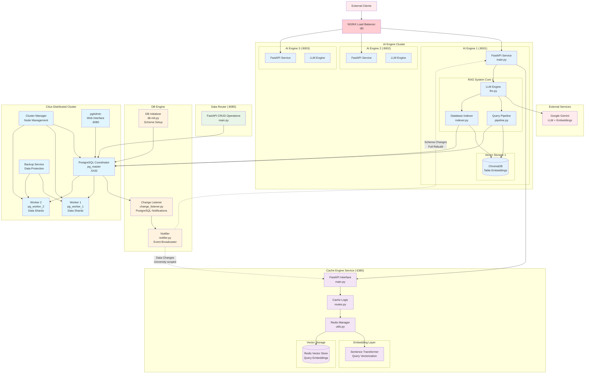
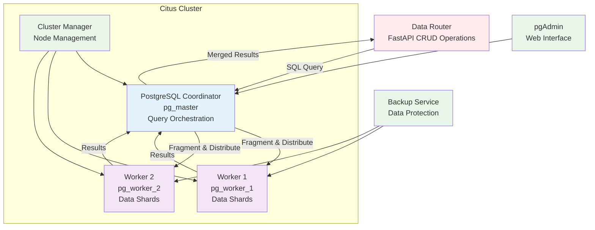
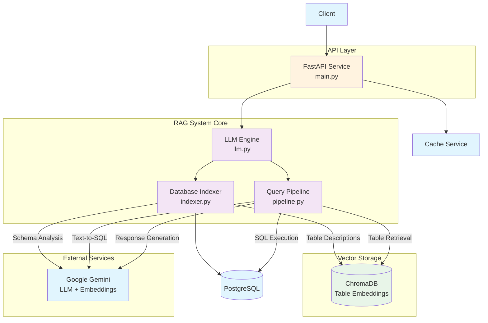
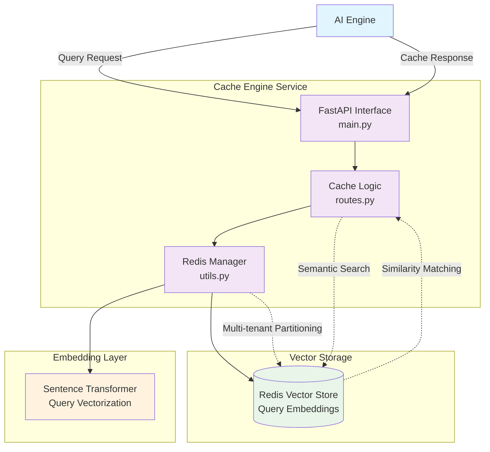
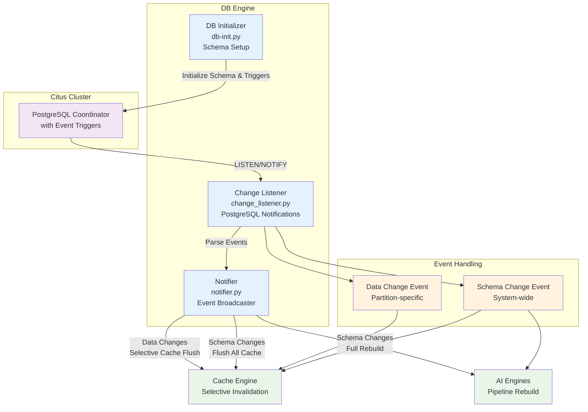

# DistRAG: Distributed RAG Database System

DistRAG is a containerized, distributed database platform build on **PostreSQL** and the Citus extension, designed for scalable query processing and *Retrieval-Augmented Generation* (RAG) tasks. It combines a Citus-based Postgres cluster with additional microservices for request routing, caching and AI-powered data processing. The system enables **horizontal scaling** of the database (by adding worker nodes), **parallel query execution** across nodes, and high availability via replication and automated backup/recovery. DistRAG's design supports scenarios such as large-scale analytics or AI-assisted question-answering over a growing dataset, all while maintaining a single entry points for the clients.

## Citus Cluster

At the core of DistRAG is a Citus Cluster: one PostgreSQL instance acts as a **Coordinator** and several other acts as **Workers**. The coordinator holds metadata about the distributed tables and orchestrates queries, which each worker stores shards (horizontal partitions) of the data [^1]. Incoming SQL queries (from the data-router) service are submitted to the coordinator; it then parallelizes each query for fragmenting it and sending the fragments to all the relevant workers. Each worker processes it shard locally, and the coordinator merges the results before returning them. This enables DistRAG to utilize the combined CPU and memory of the cluster for high-throughput query handling. Citus also replicates each shard on multiple workers (for redundancy), and supports **dynamic scaling**: new worker nodes can be added on-the-fly to capacity.

## AI Engine (RAG)

The AI Engine in DistRAG enables users to query structured data in the distributed Citus cluster using natural language through a Retrieval-Augmented Generation (RAG) pipeline. When a user submits a prompt, the engine leverages a Gemini-based language model to understand the question, retrieve relevant database tables, generate an appropriate SQL query, execute it, and return a synthesized answer. This pipeline is built using LlamaIndex components like **SQLRetriever**, **VectorStoreIndex**, and **QueryPipeline**, which combine semantic retrieval and language-to-SQL generation.

Behind the scenes, the system is composed of three main modules: indexer.py, which semantically summarizes and embeds table schemas into a vector store; pipeline.py, which builds a modular SQL query pipeline that interprets user intent and executes SQL; and llm.py, which manages threading, environment config, model/key rotation, and persistent vector stores (via Chroma). The architecture ensures scalable, schema-aware, and human-friendly querying over large datasets without requiring SQL knowledge from the end user.

#### NGINX (nginx-ai-engine) 
An NGINX proxy/load balancer in front of the AI Engine. It distributes incoming inference requests across one or more AI engine containers for high throughput and fault tolerance.

## Cache Engine

The Cache Engine in DistRAG acts as a caching layer that reduces redundant computation and database load by storing and retrieving previously seen query-response pairs. Backed by Redis with **vector search capabilities**, this service semantically caches responses by embedding incoming queries and indexing them in Redis for **approximate nearest-neighbor (ANN)** search.

At its core, the RedisManager (defined in utils.py) initializes a Redis instance and a SentenceTransformer-based embedder, both configurable via environment variables. Each user query is encoded into a dense vector and stored along with its response under a namespace defined by the **partitioning index** (multi-tenancy). The system supports configurable cache eviction (e.g., by size or policy) and can flush entries per university.

This caching strategy offers significant performance benefits by offloading repeat queries and enabling fast semantic lookups without full SQL execution. It also provides a foundation for personalization (e.g., cache per university or user group) and aligns well with the vector-based retrieval paradigm used throughout DistRAG.

## DB Engine

The DB Engine in DistRAG is a PostgreSQL-based data infrastructure component built atop a Citus coordinator. Beyond storing and distributing data shards across workers, this engine includes intelligent runtime services to initialize the schema, listen for database changes, and notify external systems (like the cache and AI engine) when updates occur. This ensures data consistency, schema awareness, and cache invalidation across the distributed system.

When a schema change (such as table creation or modification) occurs, the engine broadcasts notifications to all registered LLM Engine instances. This triggers a full pipeline rebuild, ensuring that the AI system stays aware of the latest database structure and can continue generating accurate SQL from natural language prompts. In contrast, when a data update happens—specifically involving the partitioning key (e.g., university_id)—the DB Engine selectively notifies the Cache Engine. This results in a targeted flush of only the cache entries associated with the affected partition, preserving other cached results and minimizing performance impact. This bifurcation of update handling—schema-triggered pipeline rebuilds and data-triggered scoped cache invalidation—ensures the system remains both up-to-date and efficient, particularly in multi-tenant deployments.

## Worker Backup/Recovery

DistRAG’s **Worker Backup and Worker Recovery** services ensure fault tolerance and data durability across the distributed Citus worker nodes. The backup service is initiated only after the worker cluster signals successful initialization. It performs periodic incremental WAL archiving and scheduled full backups of each worker using PostgreSQL-native tools like pg_basebackup. These operations are coordinated via worker-backup.sh, which supports dynamic worker discovery, retry logic, and backup rotation with configurable retention policies. The backup process is monitored through a dedicated entrypoint script that verifies readiness and ensures that initial snapshots are successfully taken before the system proceeds to serve traffic.

On the other hand, the Worker Recovery service continuously monitors the backup signal and launches a watchdog (worker-recovery.py) that uses the Docker API to detect failed or missing worker containers. When a failure is detected, the recovery logic automatically provisions a new container and restores the most recent backup for the corresponding worker using the available archive data. This hands-free approach allows DistRAG to quickly recover from node crashes, data corruption, or machine failures without manual intervention, ensuring high availability and minimal data loss across the Citus cluster.

[^1]: [Citus Documentation](https://docs.citusdata.com/en/v7.0/aboutcitus/introduction_to_citus.html#:~:text=Coordinator%20%2F%20Worker%20Nodes%C2%B6)
